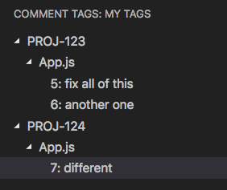

# comment-tagger README

Comment Tagger keeps track of all the comments you tag. Comment tagging is a more organized approach to using todos

## Features

Comments can be tagged like so:

```javascript
// @{tag} {description}
```

Tags are organized first by tag, then by file.

For example, if you put these lines in a file called 'App.js':

```javascript
// @PROJ-123 fix all of this
// @PROJ-123 another one
// @PROJ-124 different
```

You will get this result:



## Known Issues

- Complete lack of configuration

## Credits

Tag icon by Pondok Multimedia from the Noun Project
